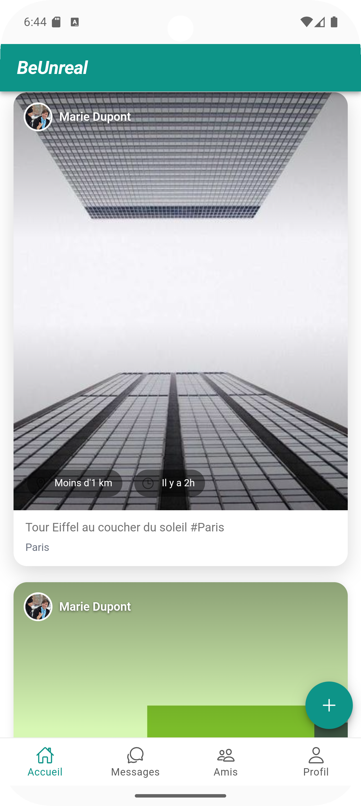
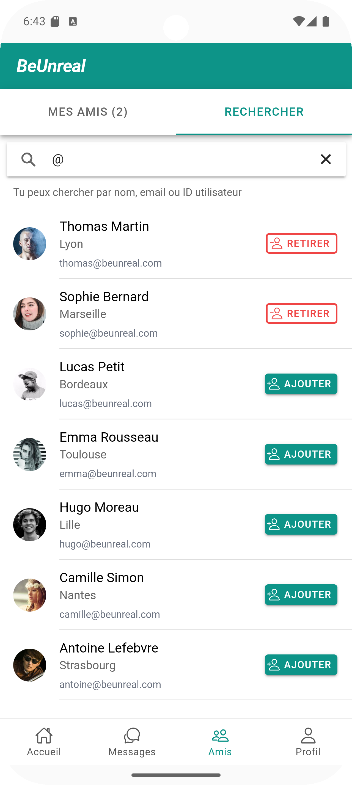
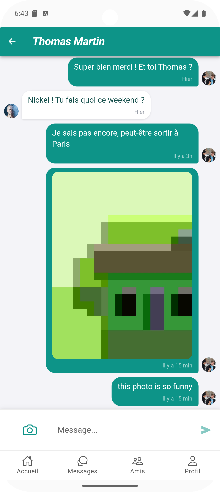
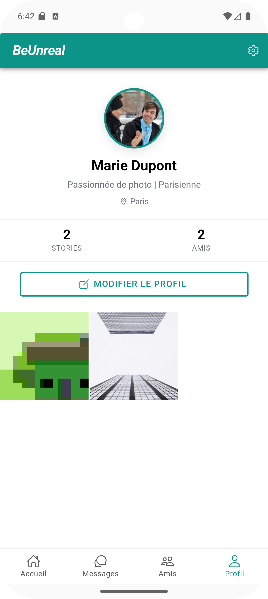

# BeUnreal

BeUnreal est une application mobile de réseau social permettant de partager des stories géolocalisées, d'envoyer des messages privés ou en groupe, et de découvrir des utilisateurs autour de soi.

---

## Fonctionnalités

### Gestion du compte

Créez un compte en renseignant votre nom d'utilisateur, votre email, votre mot de passe et votre ville. Une fois connecté, vous pouvez modifier votre profil (nom, bio, ville) et supprimer votre compte depuis les paramètres.

### Stories géolocalisées

L'onglet **Accueil** affiche les stories publiées autour de votre position. Chaque story indique la distance qui vous sépare de son auteur. Appuyez sur une story pour la voir en plein écran et accéder au profil de son auteur.

Pour publier votre propre story, appuyez sur le bouton **+** en bas à droite. Sur Android, l'appareil photo s'ouvre directement. Sur navigateur, vous pouvez choisir une image depuis votre galerie. Ajoutez une légende et publiez.

### Amis

L'onglet **Amis** comporte deux sections :

- **Mes amis** — liste de vos amis avec accès rapide à leur profil ou à une conversation directe.
- **Rechercher** — recherchez un utilisateur par nom, email ou identifiant et ajoutez-le à votre liste d'amis.

### Messagerie

L'onglet **Messages** regroupe vos conversations en deux segments :

- **Directs** — conversations privées avec un ami. Appuyez sur **+** pour en démarrer une nouvelle.
- **Groupes** — conversations de groupe. Appuyez sur **+** pour créer un nouveau groupe, lui donner un nom et sélectionner des participants.

Dans une conversation (directe ou de groupe), vous pouvez envoyer du texte et des photos. Sur Android, le bouton caméra ouvre directement l'appareil photo.

### Profil

L'onglet **Profil** affiche vos informations, le nombre de stories publiées et votre nombre d'amis. Appuyez sur **Modifier le profil** pour changer votre nom, votre bio ou votre ville. Accédez aux **Paramètres** (icône en haut à droite) pour basculer en mode sombre, vous déconnecter ou supprimer votre compte.

---

## Comptes de démonstration

L'application se lance avec des données pré-remplies. Tous les comptes partagent le même mot de passe : **password123**

| Utilisateur | Email |
|---|---|
| Marie Dupont | marie@beunreal.com |
| Thomas Martin | thomas@beunreal.com |
| Sophie Bernard | sophie@beunreal.com |
| Lucas Petit | lucas@beunreal.com |
| Emma Rousseau | emma@beunreal.com |
| Hugo Moreau | hugo@beunreal.com |
| Camille Simon | camille@beunreal.com |
| Antoine Lefebvre | antoine@beunreal.com |
| Lea Fontaine | lea@beunreal.com |
| Nathan Girard | nathan@beunreal.com |
| Chloe Dubois | chloe@beunreal.com |
| Maxime Leroy | maxime@beunreal.com |

> Les données sont stockées en mémoire et se réinitialisent à chaque redémarrage de l'application.

---

## Documentation technique

Les instructions d'installation et de lancement sont disponibles dans [doc/SETUP.md](doc/SETUP.md).
